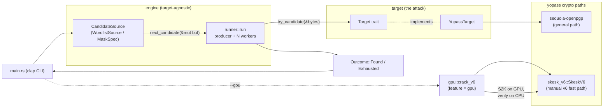
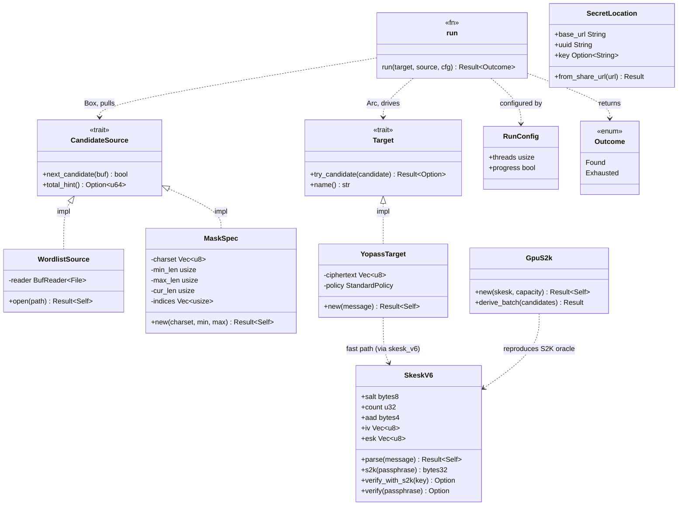
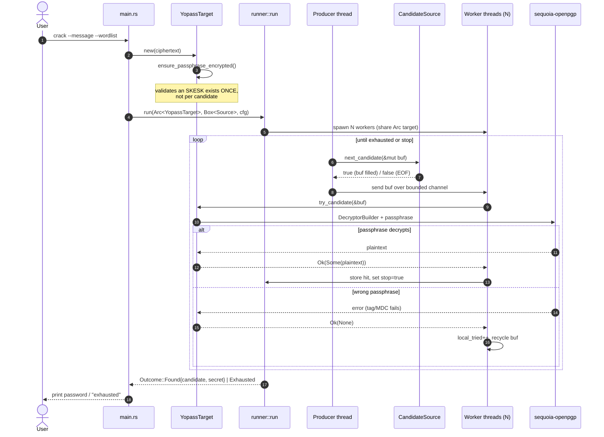
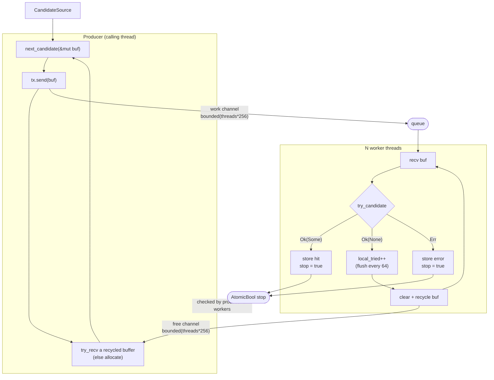
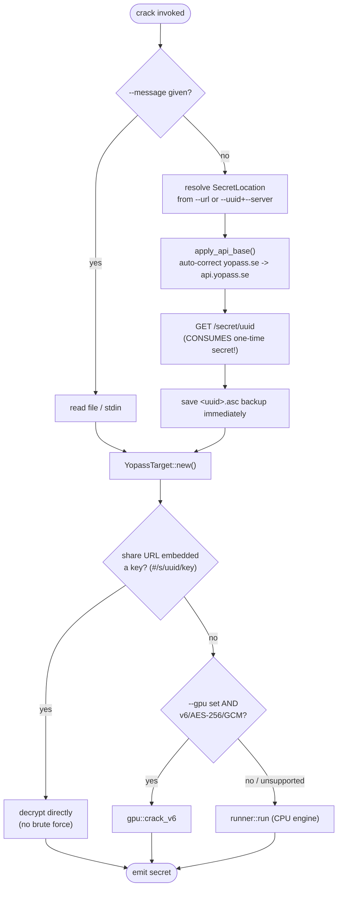
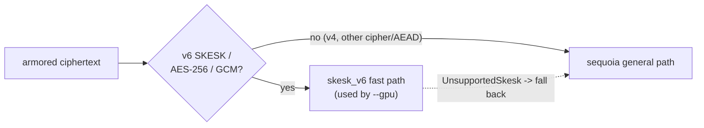
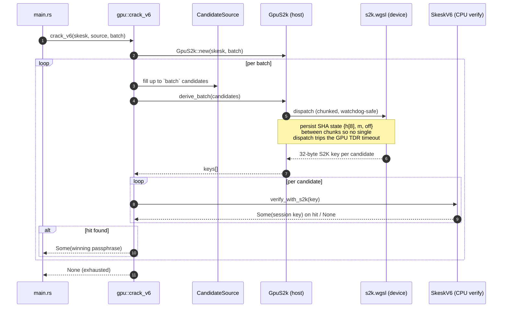
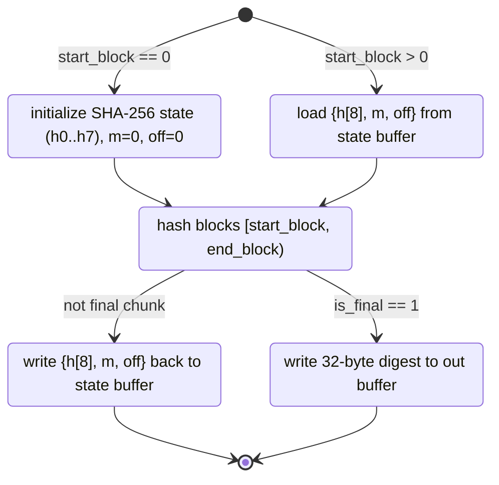
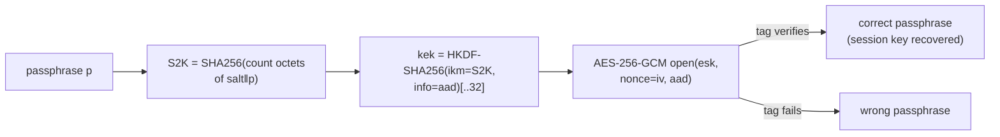
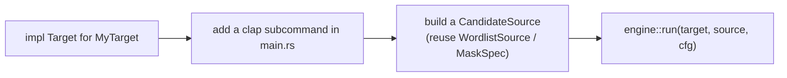

# Architecture

`karkinos-brute` is a small, pluggable **offline brute-force framework** in Rust.
The engine (candidate generation + parallel dispatch) is target-agnostic; each
attack is a module that implements one trait. The only bundled target is
`yopass` — offline recovery of a weak *custom password* on a yopass secret's
OpenPGP ciphertext.

> The crate, binary, and library are named `bruteforcer` even though the repo is
> `karkinos-brute`. CLI examples and `use bruteforcer::...` paths use that name.

This document explains how the pieces fit together. For build/test commands and
operational notes see [`../CLAUDE.md`](../CLAUDE.md) and [`../README.md`](../README.md).

---

## 1. The big picture

The design separates three concerns, so a new attack is *just* a new `Target`
implementation and the engine is reused unchanged:

| Concern | Module | Question it answers |
|---|---|---|
| **Candidate generation** | `engine::candidate` | *Where do guesses come from?* |
| **Dispatch** | `engine::runner` | *How are guesses run (parallel, stop-on-hit)?* |
| **Target** | `target` | *What is a guess tested against?* |



The GPU backend is an alternative dispatch path for one specific ciphertext
format; it bypasses `runner` and drives `skesk_v6` directly (see §6).

---

## 2. Types and traits (class diagram)



### The two traits, in words

```rust
pub trait CandidateSource: Send {
    // Overwrite `buf` with the next candidate; false at exhaustion.
    fn next_candidate(&mut self, buf: &mut Vec<u8>) -> bool;
    fn total_hint(&self) -> Option<u64> { None }
}

pub trait Target: Send + Sync {
    // Ok(Some(plaintext)) = hit (stops the run)
    // Ok(None)            = clean miss (the common case)
    // Err(_)              = FATAL, aborts the whole run
    fn try_candidate(&self, candidate: &[u8]) -> anyhow::Result<Option<Vec<u8>>>;
    fn name(&self) -> &str;
}
```

The `Err`-is-fatal rule matters: a wrong passphrase must be `Ok(None)`, never
`Err`. `Err` is reserved for malformed ciphertext / I/O — a target that errored
per-candidate would otherwise burn the entire keyspace doing nothing.

---

## 3. CPU crack — end-to-end sequence

This is what `bruteforcer yopass crack --message secret.asc --wordlist words.txt`
does. (Fetching, the embedded-key short-circuit, and the GPU branch are covered
in later sections.)



---

## 4. The runner concurrency model

`runner::run` is one **producer** thread feeding N **worker** threads through a
*bounded* channel. A second bounded channel recycles spent buffers so the
steady-state hot path performs no heap allocation.



Key properties:

- **Backpressure.** The bounded work channel (`threads * 256`) stops the producer
  from racing ahead and buffering the whole keyspace in memory. Mask keyspaces
  are astronomically large, so they are streamed lazily, never materialized.
- **Stop-on-hit.** The first hit sets an `AtomicBool`; producer and workers both
  observe it and wind down. The winning `(candidate, secret)` is kept under a
  `Mutex` that is contended exactly once (on success).
- **Zero-alloc steady state.** Workers return spent buffers via the free channel;
  the producer refills and resends them. Allocation happens only while the
  pipeline first fills.
- **Batched progress.** Each worker counts locally and flushes to the shared
  atomic every `PROGRESS_FLUSH` (64) guesses — off the hot path for cheap targets,
  yet still sub-second for slow ones like yopass.
- **Errors are fatal.** A worker `Err` is stored and stops the run; `run` returns
  it to the caller.

---

## 5. yopass: obtaining the ciphertext and choosing a path

Before any cracking, `main.rs` resolves *where the ciphertext comes from* and
whether brute force is even needed.



> ⚠️ **One-time secrets.** Fetching consumes (deletes) a one-time secret
> server-side, so the fetched blob is saved to `<uuid>.asc` *immediately* — a
> failed crack must never lose the only copy. Re-crack the saved file with
> `--message`.

### Two decryption paths for the same ciphertext

`YopassTarget` (the CPU engine) uses **sequoia-openpgp**, which handles any
OpenPGP symmetric message. `skesk_v6::SkeskV6` is a hand-rolled decode + verify
for *only* the modern yopass format (RFC 9580 **v6 SKESK / AES-256 / GCM**); it
exists because it is the exact oracle the GPU backend reproduces, and it returns
`UnsupportedSkesk` for anything else so callers fall back to sequoia.



---

## 6. GPU backend (`--features gpu`)

The expensive part of every guess is the **S2K**: hashing ~16 MiB of
`salt || passphrase` through SHA-256 (16,777,216 octets by default). The GPU
backend offloads *only* that to a WGSL compute shader; HKDF and the AES-GCM tag
check stay on the CPU via `SkeskV6::verify_with_s2k`.



### Why the S2K is chunked (state machine)

A single candidate's S2K is ~262,144 SHA-256 blocks. Doing that in one dispatch
would trip the OS GPU watchdog (TDR). The shader instead processes a bounded
range of blocks per dispatch and persists the running SHA state between
dispatches; the host issues `ceil(num_blocks / chunk)` dispatches and the final
one writes the digest.



### The verification chain (one candidate)

For each candidate passphrase `p`, both the CPU fast path and the GPU+CPU split
compute the same chain:



`aad = [0xC3, version, cipher_algo, aead_algo]`. On the GPU path only the first
box (S2K) runs on the device; HKDF + AEAD run on the host. On a confirmed hit the
full plaintext is recovered with one ordinary sequoia decrypt.

---

## 7. Adding a new target

The engine is reused unchanged — implement `Target` and wire a subcommand:



```rust
pub trait Target: Send + Sync {
    fn try_candidate(&self, candidate: &[u8]) -> anyhow::Result<Option<Vec<u8>>>;
    fn name(&self) -> &str;
}
```

Return `Ok(Some(plaintext))` on a hit, `Ok(None)` on a clean miss, and `Err` only
for unrecoverable problems. Candidate generation, parallel dispatch, stop-on-hit,
progress, and buffer recycling all come for free from `engine::run`.

---

## 8. Source map

```
src/
  lib.rs           crate root; re-exports engine + target (+ gpu under feature)
  main.rs          clap CLI: fetch / crack subcommands, path selection
  engine/
    candidate.rs   CandidateSource trait; WordlistSource, MaskSpec (lazy odometer)
    runner.rs      parallel dispatch, bounded channels, stop-on-hit, progress
  target/
    mod.rs         Target trait
    yopass.rs      URL parsing, fetch, sequoia decrypt (general path)
    skesk_v6.rs    manual v6-SKESK parse + S2K + HKDF + AES-256-GCM verify
  gpu/             (feature = "gpu")
    mod.rs         wgpu host: batched S2K dispatch + CPU verify
    s2k.wgsl       SHA-256 S2K compute shader (chunked, watchdog-safe)
tests/
  vectors.rs       known-answer regression tests (CPU paths)
  gpu.rs           GPU backend tests (auto-skip without an adapter)
  fixtures/        real captured ciphertexts (v6/GCM and classic v4)
```
